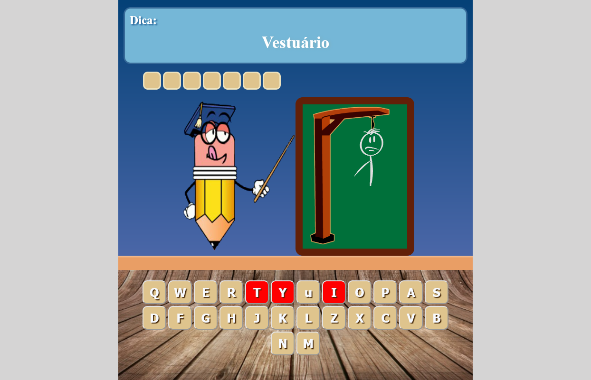
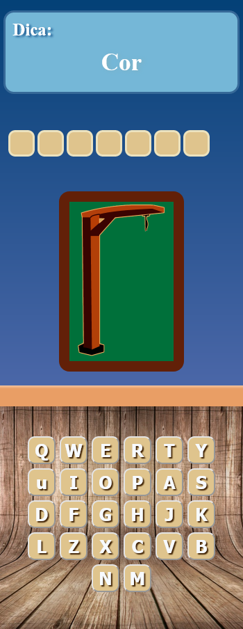

<h1 align='center'>Jogo da forca</h1>

<h2>📋 Jogo da forca criado com html, css e javascript</h2>
<h2>🎨 Layouts</h2>
<h3>Web</h3>

<h3>Mobile</h3>

<h2>⚠️ Licença</h2>
<h3>Esse projeto esta sobre a licença <a href='LICENSE'>MIT</a>.</h3>
<h3>Feito por <a href="https://github.com/Rodrigo-Souza-DEV">Rodrigo Souza</a>.</h3>

